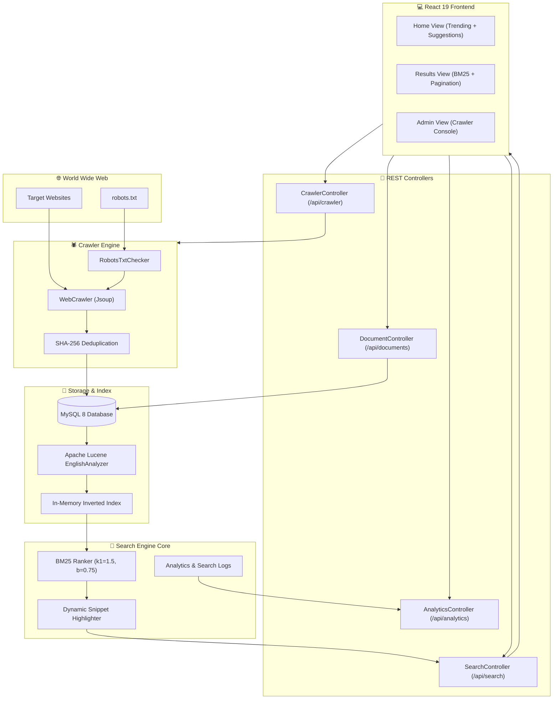

# 🔍 MiniSearch - Full-Stack Search Engine & Web Crawler

MiniSearch is a complete, high-performance web search engine built from scratch using **Spring Boot (Java 26)** and **React 19 + Tailwind CSS 4**. It features an integrated web crawler with `robots.txt` compliance, Apache Lucene tokenization, an in-memory inverted index, Okapi BM25 relevance ranking, real-time search analytics, and an interactive admin dashboard.

---

## 🌟 Key Features

- **🕷️ Polite Multi-Threaded Web Crawler**:
  - Respects standard `robots.txt` directives (user-agent matching, disallow rules).
  - Domain-bounded recursive crawling with configurable depth and page limits.
  - SHA-256 content hashing to automatically detect and discard duplicate web pages.
- **⚡ In-Memory Inverted Index**:
  - Fast posting lists mapping terms to document IDs and term frequencies.
  - Title boosting (terms occurring in document titles receive higher weighting).
  - Sub-millisecond lookup and index rebuilding capability.
- **🎯 Okapi BM25 Ranking Algorithm**:
  - State-of-the-art probabilistic information retrieval ranking (\(k_1 = 1.5, b = 0.75\)).
  - Document length normalization to prevent bias towards excessively long pages.
- **📊 Search Analytics & Autocomplete**:
  - Real-time query suggestion dropdown with debounce.
  - Trending search queries based on user activity.
  - Click-through tracking and response latency profiling.
- **💻 Modern React UI**:
  - Google-inspired minimalist home search interface.
  - Search results page with keyword snippet highlighting and pagination.
  - Admin & Crawler management dashboard with live status cards and document repository browser.

---

## 🏗️ System Architecture



---

## 📐 BM25 Ranking Algorithm

MiniSearch calculates document relevance for a query \(Q = \{q_1, q_2, \dots, q_n\}\) using the **Okapi BM25** formula:

$$\text{Score}(D, Q) = \sum_{i=1}^{n} \text{IDF}(q_i) \cdot \frac{f(q_i, D) \cdot (k_1 + 1)}{f(q_i, D) + k_1 \cdot \left(1 - b + b \cdot \frac{|D|}{\text{avgdl}}\right)}$$

Where:
- $f(q_i, D)$ is the term frequency of token $q_i$ in document $D$.
- $|D|$ is the length of document $D$ in tokens.
- $\text{avgdl}$ is the average document length across the entire corpus.
- $k_1 = 1.5$ controls term frequency saturation.
- $b = 0.75$ controls document length penalty.
- $\text{IDF}(q_i)$ is the Robertson-Spärck Jones Inverse Document Frequency:

$$\text{IDF}(q_i) = \ln \left( \frac{N - n(q_i) + 0.5}{n(q_i) + 0.5} + 1 \right)$$

---

## 🔌 API Endpoints Reference

### 1. Search Endpoints
| Method | Endpoint | Description | Parameters |
|---|---|---|---|
| `GET` | `/api/search` | Fast query search | `q` (string), `limit` (int, def: 10), `offset` (int, def: 0) |
| `POST` | `/api/search` | Search via request body | JSON `{ "query": "...", "limit": 10, "offset": 0 }` |
| `GET` | `/api/search/suggestions`| Autocomplete suggestions | `q` (prefix string), `limit` (int, def: 5) |
| `POST` | `/api/search/click` | Log result click | `query`, `docId`, `position` |

### 2. Crawler Endpoints
| Method | Endpoint | Description | Parameters |
|---|---|---|---|
| `POST` | `/api/crawler/crawl` | Start crawling job | JSON `{ "seedUrl": "https://spring.io/blog", "maxPages": 25 }` |
| `POST` | `/api/crawler/enqueue` | Add URL to queue | `url` (string) |

### 3. Analytics Endpoints
| Method | Endpoint | Description | Parameters |
|---|---|---|---|
| `GET` | `/api/analytics/stats` | System KPI stats | None |
| `GET` | `/api/analytics/trending`| Trending queries | `limit` (int, def: 10) |
| `POST` | `/api/analytics/reindex` | Rebuild inverted index | None |

### 4. Document Management Endpoints
| Method | Endpoint | Description | Parameters |
|---|---|---|---|
| `GET` | `/api/documents` | Paginated documents | `page` (int, def: 0), `size` (int, def: 20) |
| `GET` | `/api/documents/{id}` | Get document by ID | `id` (path variable) |
| `DELETE` | `/api/documents/{id}` | Delete document | `id` (path variable) |

---

## 🛠️ Tech Stack

- **Backend**:
  - Java 26 / Spring Boot 3.4
  - Spring Data JPA / Hibernate
  - MySQL 8.0+
  - Apache Lucene 8.11 (EnglishAnalyzer, TokenStream, Porter Stemmer)
  - Jsoup 1.17 (HTML parsing and web scraping)
  - Lombok
- **Frontend**:
  - React 19
  - Vite 8
  - Tailwind CSS 4
  - React Router DOM 7
  - Axios

---

## 🐳 Docker Deployment (Recommended)

You can launch the entire stack (MySQL 8 database, Spring Boot server, and React Nginx frontend) with a single command using Docker Compose:

```bash
docker compose up --build
```

- **Frontend Application**: `http://localhost` (or `http://localhost:5173`)
- **Backend API**: `http://localhost:8080/api`
- **Crawler / Admin Dashboard**: `http://localhost/admin`

To stop and remove containers:
```bash
docker compose down
```

---

## 🚀 Local Development Setup

### Prerequisites
- **Java**: JDK 21 or later (`java -version`)
- **Node.js**: v18 or later (`node -v`, `npm -v`)
- **MySQL**: MySQL 8.0 running on `localhost:3306`

### 1. Database Setup
Create the MySQL database (or let Spring Boot create it automatically):
```sql
CREATE DATABASE IF NOT EXISTS minisearch CHARACTER SET utf8mb4 COLLATE utf8mb4_unicode_ci;
```

Ensure your credentials in `server/src/main/resources/application.properties` match your local MySQL configuration:
```properties
spring.datasource.url=jdbc:mysql://localhost:3306/minisearch?createDatabaseIfNotExist=true
spring.datasource.username=root
spring.datasource.password=root
```

### 2. Start Backend Server
```powershell
cd server
.\mvnw.cmd spring-boot:run
```
The server will start on `http://localhost:8080`. On initial boot, `DataInitializer` will automatically load any existing documents from MySQL into the in-memory inverted index.

### 3. Start Frontend Client
In a separate terminal:
```powershell
cd client
npm install
npm run dev
```
The client will start on `http://localhost:5173`.

---

## 🖥️ Usage Guide

1. **Crawl Web Content**:
   - Open `http://localhost:5173/admin`.
   - Enter a seed URL (e.g. `https://spring.io/blog` or `https://react.dev/blog`).
   - Choose the maximum number of pages to crawl (e.g. 20) and click **Start Crawler Job**.
   - Monitor the crawl metrics (pages crawled, indexed, duplicates skipped, duration).
2. **Explore Indexed Documents**:
   - Under the **Indexed Documents Repository** section on the Admin page, review all crawled documents, inspect term counts, or delete unwanted records.
3. **Search**:
   - Go to `http://localhost:5173`.
   - Type any query in the search bar. Real-time autocomplete suggestions appear automatically.
   - Press **Enter** or click **Search** to view BM25-ranked results with keyword highlights and relevance scores.
